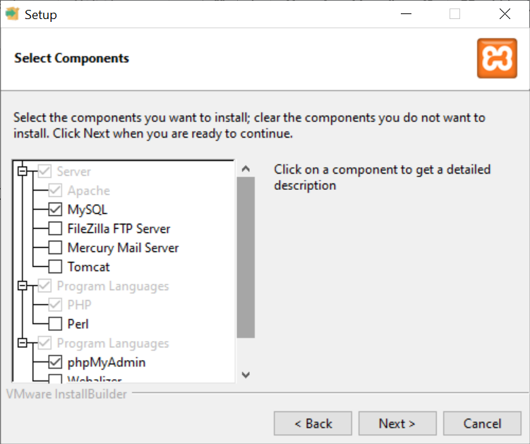
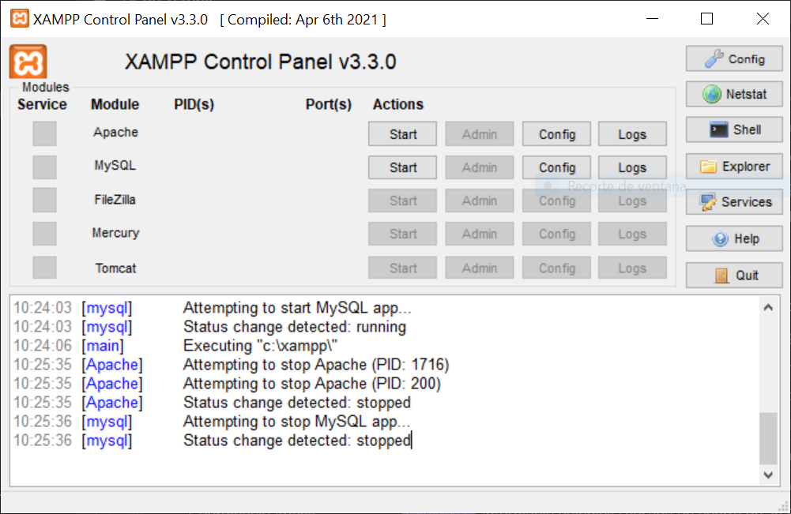
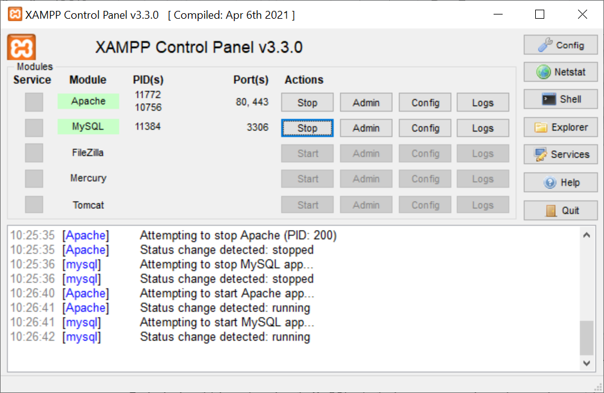
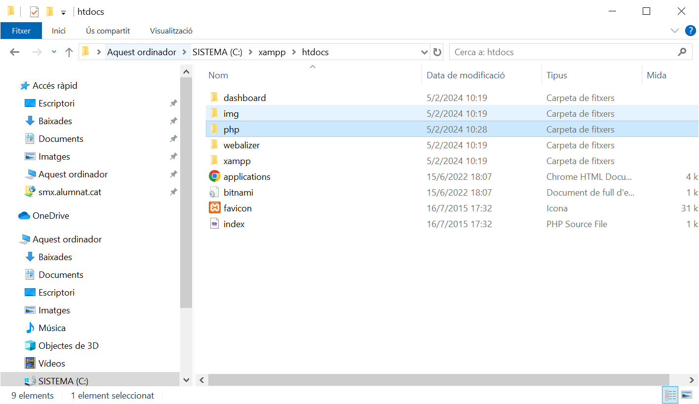
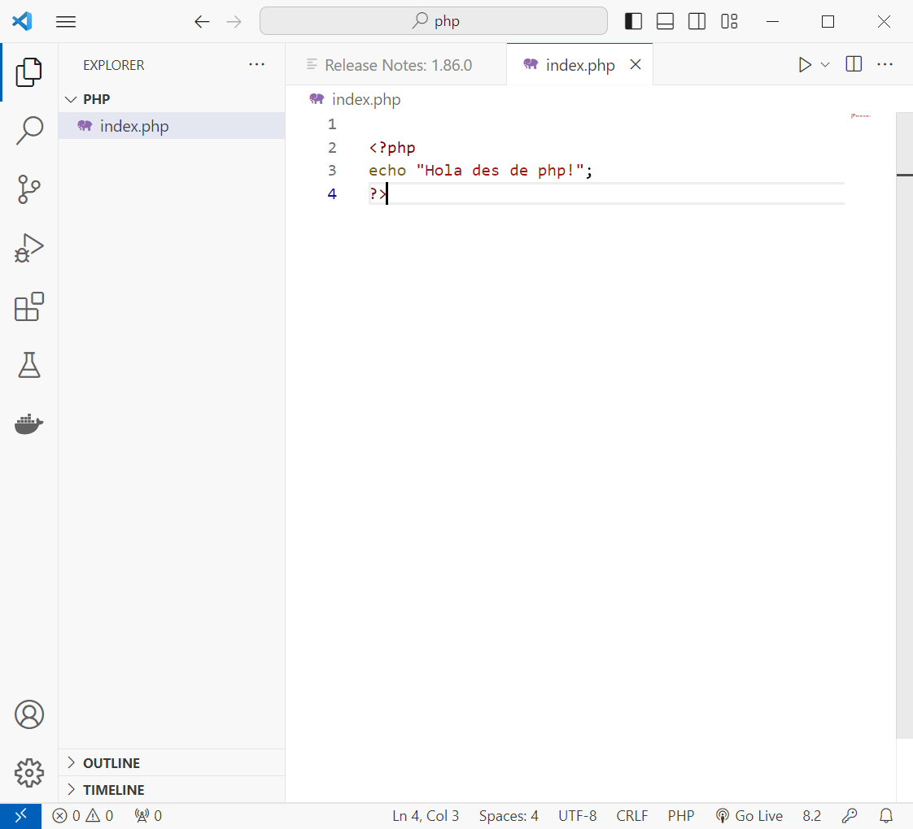
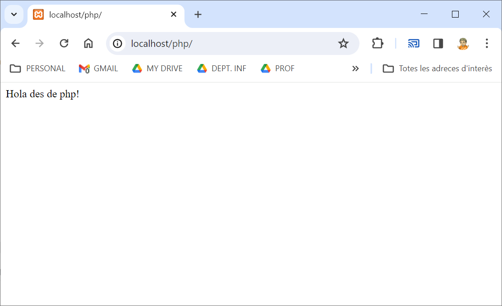

# PHP AMB XAMPP

Instal·la [XAMPP](https://www.apachefriends.org/) seleccionat tan sols Apache, MySQL i phpMyAdmin:

Acaba la instal·lació amb les opcions per defecte.

En acabar, obre l'aplicació:

I inicia l'Apache i el MySQL:

Ara ves al botó d'explorer i t'obrirà la carpeta del XAMPP. allà, dins de htpdocs, crea una carpeta anomenada php que és on treballaràs:

Obre la carpeta php amb Visual Code i crea un fitxer `index.php` com aquest:

Finalment entra a la URL [http://localhost/php](http://localhost/php) i veuràs el teu codi PHP executat:

